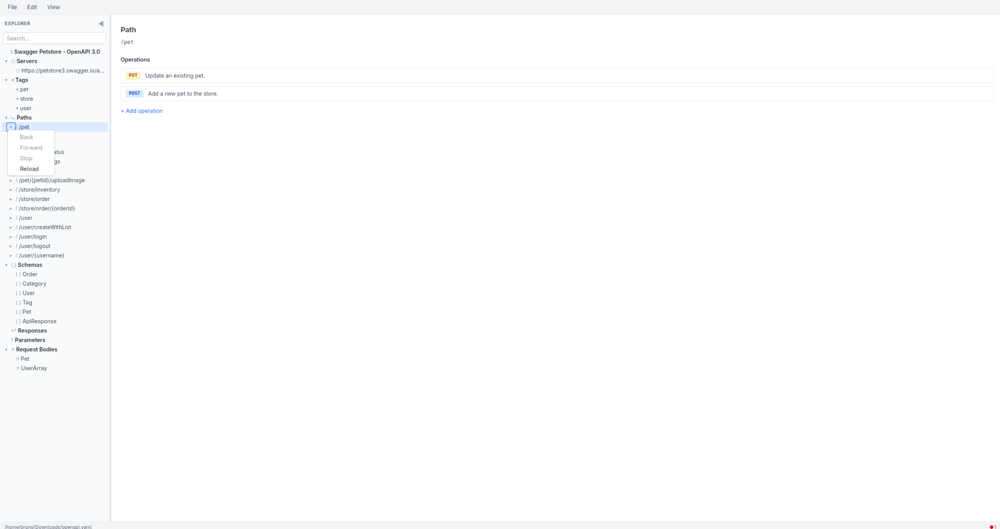

<div align="center">
  
  
  # OpenAPI Editor
  
  A cross-platform desktop application for visually editing OpenAPI 3.1 specifications. Edit your API specs using form-based panels instead of writing raw YAML.
  
  Built with [Tauri 2](https://v2.tauri.app/), React 19, and Tailwind CSS v4.
</div>

> [!WARNING]
> This software was vibe coded in a weekend with Opus 4.6 to solve a personal itch. Use at your own risk.

## Screenshot

<div align="center">
  
</div>

## Features

- Form-based editing for all OpenAPI 3.1 elements (paths, operations, schemas, responses, parameters, request bodies)
- Tree sidebar navigation with search and filtering
- YAML file I/O with comment preservation
- Clipboard paste and copy support
- Real-time inline validation via Redocly
- Full undo/redo
- Dark mode with system theme detection
- Create new specs from scratch
- Recent files list
- Keyboard shortcuts (Ctrl+S, Ctrl+O, Ctrl+N, Ctrl+Z, etc.)

## Prerequisites

- [Devenv](https://devenv.sh/) (recommended) or manually install:
  - Node.js 24+
  - [pnpm](https://pnpm.io/)
  - Rust stable
  - [Tauri system dependencies](https://v2.tauri.app/start/prerequisites/)
- [Task](https://taskfile.dev/) (optional, for development commands)

## Getting Started

```bash
# Enter the dev environment (required for pkg-config and system libraries)
devenv shell

# Install dependencies
task install
# or: pnpm install --frozen-lockfile

# Start development server
task dev
# or: pnpm run tauri dev
```

**Important**: Always run `devenv shell` before any build commands. This sets up `PKG_CONFIG_PATH` and other environment variables needed for Tauri's WebKit2GTK dependencies.

## Development Tasks

Run `task --list` to see all available tasks. Key ones:

| Task | Description |
|------|-------------|
| `task dev` | Start Tauri dev server with hot reload |
| `task dev:web` | Start Vite dev server only (no Tauri window) |
| `task check` | Run lint + type-check + tests |
| `task lint` | Run ESLint |
| `task typecheck` | Run TypeScript type checking |
| `task test` | Run tests once |
| `task test:watch` | Run tests in watch mode |
| `task build` | Build for current platform |
| `task build:flatpak` | Build Flatpak bundle |
| `task icons` | Regenerate app icons from SVG |
| `task clean` | Remove build artifacts |

## Building

```bash
# Production build for current platform
task build

# Debug build
task build:debug
```

Build artifacts are output to `src-tauri/target/release/bundle/`.

## Documentation

See the [docs/](docs/) folder for detailed documentation.


## Built with

- **Desktop Runtime:** Tauri 2
- **Web Framework:** React 19 + TypeScript
- **Styling:** Tailwind CSS v4
- **State management:** Zustand 5 + Zundo (undo/redo)
- **YAML Parsing:** eemeli/yaml (comment-preserving)
- **Validation:** @redocly/openapi-core
- **OpenAPI types:** openapi3-ts
- **$ref resolution:** @apidevtools/swagger-parser


## License

This project is licensed under the MIT License. Check [LICENSE.md](LICENSE) for details.
